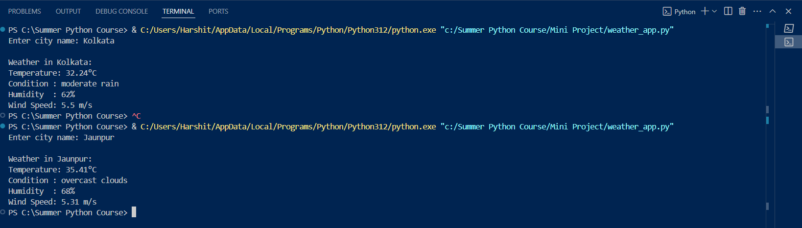

# 🌦️ Weather App (Mini Project)

This is a simple Python CLI weather app that fetches live weather data using the OpenWeatherMap API.

---

## 🚀 Features

- Fetch current weather of any city
- Shows temperature, humidity, wind speed, and weather condition
- Uses `.env` to protect API key

---

## 🔧 How to Use

1. Clone the repo
2. Create a `.env` file like this:

## 📸 Screenshot
